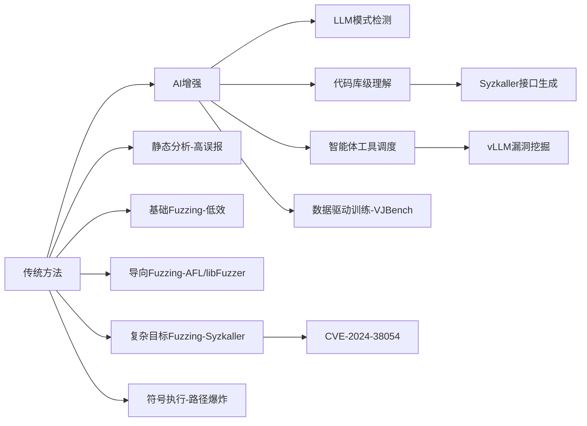

🎯

漏洞挖掘技术调研：调研一下漏洞主动挖掘技术的现状，尤其是内存类漏洞主动挖掘的现状、进展、以及未来发展趋势

### 引言

漏洞主动挖掘技术是网络安全领域的重要研究方向，旨在通过自动化或智能化手段主动发现软件或系统中的安全漏洞，以应对日益复杂的网络攻击。近年来，随着软件复杂性和漏洞数量的增加，漏洞挖掘技术从传统的静态分析、动态分析逐步向智能化、自动化方向演进，尤其在人工智能（AI）和大语言模型（LLM）的推动下取得了显著进展。

### 一、总体现状

* **技术演进**：漏洞挖掘技术经历了从人工分析到自动化工具，再到基于机器学习和深度学习的智能化阶段。**传统方法**包括静态代码分析（检查代码而不执行）、动态分析（运行程序以检测异常）和模糊测试（Fuzzing，向程序输入随机数据以触发异常）。近年来，AI技术尤其是大模型的应用显著提升了漏洞挖掘的效率和精度。

* **应用领域**：漏洞挖掘广泛应用于操作系统、应用程序、嵌入式系统、网络协议等，尤其在关键基础设施（如工业控制系统、物联网设备）中需求迫切。

* **挑战**：复杂软件系统（如Linux内核）代码量庞大，漏洞类型多样，传统方法难以应对未知漏洞（0day漏洞）。此外，漏洞挖掘的法律规制（如“瓦森纳协定”对漏洞出口的限制）也对技术发展形成一定约束。[\[网络安全漏洞挖掘的法律规制](https://blog.csdn.net/Javachichi/article/details/144102967)[\]](https://blog.csdn.net/Javachichi/article/details/144102967)

### 二、内存类漏洞主动挖掘的现状与进展

> **梳理逻辑：从“局部精准但低效”向“全局智能且高效”**

内存类漏洞（如缓冲区溢出、释放后重用、类型混淆等）是软件安全中最常见且危害严重的漏洞类型，因其可被利用来执行任意代码或提权而备受关注。内存类漏洞的主动挖掘在技术上取得了以下进展：

#### 1. 传统方法：核心技术演进

* **静态分析（Static Analysis）**
    * **原理**：通过分析源码/二进制代码的数据流、控制流识别内存操作缺陷（如空指针解引用、缓冲区溢出）。
    * **工具**：Coverity、Clang Static Analyzer、Fortify SCA。
    * **优势**：早期介入，全路径覆盖潜力。
    * **局限**：
        * 高误报率（难以精确判定路径可达性）
        * 对复杂逻辑漏洞（如竞态条件）检测弱

    * **引用**：[Clang Static Analyzer](https://clang-analyzer.llvm.org/)

* **动态分析与模糊测试（Dynamic Analysis &amp; Fuzzing）**
    * **原理**：生成输入触发程序运行时异常（崩溃、内存错误）。
    * **演进阶段**：
        * **基础随机模糊测试**：低效，适用简单目标。
        * **导向性模糊测试（CGF）**：
            * **突破**：基于代码覆盖率反馈（AFL、libFuzzer）智能引导输入变异。
            * **优势**：高效挖掘函数/模块级漏洞（如解析器缺陷）。

        * **复杂目标模糊测试**：
            * **对象扩展**：内核（Syzkaller）、浏览器（Fuzzilli）、协议栈（Peach）。
            * **关键技术**：
                * 接口建模（系统调用描述）
                * 状态管理（依赖符号执行/污点跟踪）

    * **局限**：
        * 高资源消耗（CPU/时间）
        * 深度路径探索困难（覆盖率瓶颈）

    * **引用**：[AFL](https://github.com/google/AFL)｜[Syzkaller](https://github.com/google/syzkaller)

* **符号执行（Symbolic Execution）**
    * **原理**：求解路径约束条件精确定位边界违例（如缓冲区溢出）。
    * **工具**：KLEE、Angr。
    * **优势**：理论覆盖所有路径条件。（通常应在模糊测试提供目标和方向信息后，用于解决复杂约束，覆盖难以抵达的代码）
    * **局限**：
        * 路径爆炸（分支复杂度指数增长）
        * 大型程序扩展性差

    * **引用**：[KLEE](https://klee.github.io/)

***

#### 2. **AI与大模型引入：能力跃迁**

1. **大模型辅助漏洞挖掘**
    * **能力**：LLM通过模式学习检测已知漏洞变种（如API误用、CWE特征）。
    * **局限**：开放式未知漏洞挖掘能力有限。
    * **案例**：
        * Project Zero + DeepMind 发现内存安全0\-day

    * **引用**：[Project Zero案例](https://www.secrss.com/articles/72067)

2. **代码库级别上下文理解**
    * **突破**：LLM全局分析代码库结构、跨文件依赖、文档注释，降低误报。
    * **赋能传统方法**：
        * 为Syzkaller生成系统调用描述
        * 指导Fuzzer生成符合协议语法的种子

    * **引用**：[奇安信代码库级分析](https://research.qianxin.com/archives/2757)

3. **智能体（Agent）融合方法**
    * **架构**：LLM调度静态分析/Fuzzer/符号执行工具链。
    * **流程**：
        * LLM识别高风险代码区域
        * 调用Fuzzer定向测试特定API（如生成堆溢出测试用例）
        * 解析结果并迭代策略

    * **优势**：效率提升5\-10倍（奇安信实验）
    * **引用**：[奇安信智能体实践](https://blog.csdn.net/m0_73736695/article/details/144772500)

4. **数据集与模型训练**
    * **驱动力**：高质量漏洞\-修复对数据训练专用模型。
    * **案例**：
        * VJBench数据集提升Java内存漏洞检测/修复精度
        * LLM+APR（自动程序修复）减少修复时间50%

    * **引用**：[VJBench](https://blog.csdn.net/wtyuong/article/details/133908816)

***

#### 3. **典型漏洞案例**

1. **AI落地实践案例**
    * **vLLM推理库漏洞**：
        * **类型**：高危内存损坏（释放后重用/越界读写）
        * **技术**：LLM辅助代码库分析 + Fuzzer验证
        * **影响**：可导致大模型服务崩溃或RCE
        * **引用**：[奇安信vLLM分析](https://research.qianxin.com/archives/tag/%E6%BC%8F%E6%B4%9E%E5%88%86%E6%9E%90)

2. **系统级内存漏洞**
    * **CVE\-2024\-38054（Windows内核提权）**：
        * **类型**：堆溢出+权限提升
        * **技术**：复杂目标模糊测试（Syzkaller）+逆向分析
        * **机制**：畸形数据触发驱动边界检查绕过
        * **引用**：[奇安信漏洞分析](https://research.qianxin.com/archives/tag/%E6%BC%8F%E6%B4%9E%E5%88%86%E6%9E%90)

***

### **三、技术演进逻辑**

#### **核心结论**

* **传统瓶颈**：误报（静态分析）、资源消耗（Fuzzing）、路径爆炸（符号执行）。
* **AI破局点**：
    * 全局语义理解 → 降低静态分析误报
    * 复杂接口建模 → 增强Fuzzer对内核/协议目标的覆盖
    * 工具链智能调度 → 10倍效率提升（奇安信Agent）

* **未来挑战**：
    * LLM对开放式漏洞的泛化能力
    * 多工具协同的自动化验证框架

***

### 四、未来发展趋势

基于当前研究和行业动态，漏洞主动挖掘技术，尤其是内存类漏洞挖掘的未来发展趋势包括以下几个方面：

* **智能化与自动化深入融合**：

  \- **大模型优化**：未来的大模型将进一步优化上下文理解能力，结合强化学习和多模态分析，增强对未知漏洞的挖掘能力。\[\]\([https://research.qianxin.com/archives/2757](https://research.qianxin.com/archives/2757)\)

* **跨项目迁移**：通过迁移学习，将在一个项目上训练的漏洞检测模型应用于相似项目，提高通用性和效率。\[\]\([https://gitcode.csdn.net/66306747ef0d142cbb2ce0fe.html](https://gitcode.csdn.net/66306747ef0d142cbb2ce0fe.html)\)

* **智能体驱动**：AI智能体将深度整合静态分析、动态分析和模糊测试，形成全流程自动化漏洞挖掘框架，减少人工干预。

* **多粒度检测**：

* 未来的漏洞挖掘将从函数级别扩展到模块、系统甚至跨项目的多粒度分析，结合代码语义和运行时行为，提高检测复杂内存漏洞的能力。\[\]\([https://gitcode.csdn.net/66306747ef0d142cbb2ce0fe.html](https://gitcode.csdn.net/66306747ef0d142cbb2ce0fe.html)\)

* **生成式AI的双刃剑效应**：

  \- 生成式AI（如AIGC）在提升漏洞挖掘效率的同时，也可能被黑客用于生成恶意代码或自动化攻击。未来的研究需平衡攻防两端的应用，开发针对AI生成代码的防御机制。\[\]\([https://xxzx.nuc.edu.cn/info/1011/8401.htm](https://xxzx.nuc.edu.cn/info/1011/8401.htm)\)

* **法律与伦理约束**：

  \- 随着漏洞被视为“潜在武器”，各国对漏洞挖掘的法律监管将更加严格。未来技术发展需在合规框架下进行，例如遵循国家漏洞库（如美国NVD）的标准进行漏洞管理和披露。\[\]\([https://blog.csdn.net/Javachichi/article/details/144102967](https://blog.csdn.net/Javachichi/article/details/144102967)\)

* **开源与协作**：

  \- 开源社区和群智漏洞挖掘平台（如Bug Bounty）将继续推动技术进步，通过群体智能提高漏洞发现效率。\[\]\([https://www.sohu.com/a/295548143\_468736](https://www.sohu.com/a/295548143_468736)\)

### 五、挑战与应对

* **挑战**：

  \- **复杂性**：软件规模和复杂性增加（如Linux内核超过2600万行代码），传统方法难以覆盖所有路径。\[\]\([http://www.jos.org.cn/html/2020/7/6055.htm](http://www.jos.org.cn/html/2020/7/6055.htm)\)

  \- **误报率**：AI模型在复杂场景下可能产生大量误报，降低实用性。

  \- **资源需求**：模糊测试和大模型训练需要高性能计算资源，限制了中小型团队的应用。

  \- **0day漏洞**：未知漏洞的挖掘仍是难点，需更强的泛化能力。

* **应对方案**：

  \- 开发更高效的符号执行和模糊测试算法，结合AI优化路径选择。

  \- 构建高质量漏洞数据集，提升模型训练效果。

  \- 推动行业协作，建立统一的漏洞挖掘和披露标准。

### 六、出处

以下为主要信息来源：

\- DataCon 晚自习：浅谈大模型辅助漏洞挖掘 – 奇安信技术研究院\[\]\([https://research.qianxin.com/archives/2757](https://research.qianxin.com/archives/2757)\)

\- 首次利用大模型发现内存安全零日漏洞 – 安全内参\[\]\([https://www.secrss.com/articles/72067](https://www.secrss.com/articles/72067)\)

\- ISSTA 2023论文：新Java漏洞自动修复数据集 – CSDN博客\[\]\([https://blog.csdn.net/wtyuong/article/details/133908816](https://blog.csdn.net/wtyuong/article/details/133908816)\)

\- 基于机器学习的软件漏洞挖掘方法综述 – jos.org.cn\[\]\([http://www.jos.org.cn/html/2020/7/6055.htm](http://www.jos.org.cn/html/2020/7/6055.htm)\)

\- “AI+Security”系列：基于大模型的漏洞挖掘技术与实践 – CSDN博客\[\]\([https://blog.csdn.net/m0\_73736695/article/details/144772500](https://blog.csdn.net/m0_73736695/article/details/144772500)\)

\- 2024网络安全趋势前瞻展望 – xxzx.nuc.edu.cn\[\]\([https://xxzx.nuc.edu.cn/info/1011/8401.htm](https://xxzx.nuc.edu.cn/info/1011/8401.htm)\)

\- 漏洞分析 – 奇安信技术研究院\[\]\([https://research.qianxin.com/archives/tag/%25E6%25BC%258F%25E6%25B4%259E%25E5%2588%2586%25E6%259E%2590](https://research.qianxin.com/archives/tag/%25E6%25BC%258F%25E6%25B4%259E%25E5%2588%2586%25E6%259E%2590)\)

\- 漏洞挖掘技术综述与人工智能应用探索 – gitcode.csdn.net\[\]\([https://gitcode.csdn.net/66306747ef0d142cbb2ce0fe.html](https://gitcode.csdn.net/66306747ef0d142cbb2ce0fe.html)\)

\- 群智漏洞挖掘技术 – 搜狐网\[\]\([https://www.sohu.com/a/295548143\_468736](https://www.sohu.com/a/295548143_468736)\)

\- 网络安全漏洞挖掘的法律规制研究 – CSDN博客\[\]\([https://blog.csdn.net/Javachichi/article/details/144102967](https://blog.csdn.net/Javachichi/article/details/144102967)\)

### 总结

漏洞主动挖掘技术在AI和大模型的推动下，正从自动化走向智能化，尤其在内存类漏洞挖掘中取得了显著进展。未来，技术的智能化、多粒度分析和法律合规性将是发展的重点方向，同时需警惕生成式AI带来的新安全挑战。
